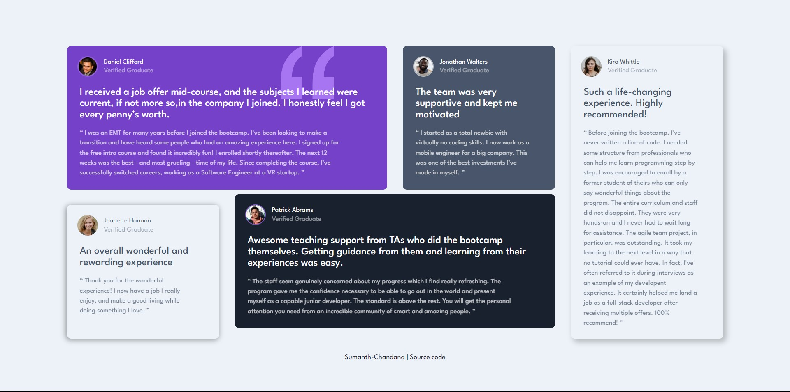
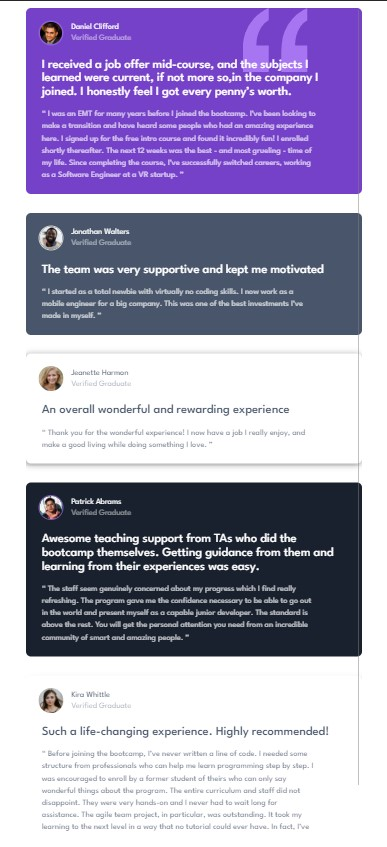

# Frontend Mentor - Testimonials grid section solution

This is a solution to the [Testimonials grid section challenge on Frontend Mentor](https://www.frontendmentor.io/challenges/testimonials-grid-section-Nnw6J7Un7). Frontend Mentor challenges help you improve your coding skills by building realistic projects. 

## Overview

### The challenge

Users should be able to:

- View the optimal layout for the site depending on their device's screen size

### Screenshot

| desktop | mobile |
| --- | --- |
|  |  |

### Links

- Solution URL: [click here](https://your-solution-url.com)
- Live Site URL: [click here](https://your-live-site-url.com)

## My process

### Built with

- 

- 

### Tools Used:

- 
 

-	

### What I learned

- Grid layout
- Animation properties
- A lot of small things
- Designing optimal layout for the site depending on their device's screen size

## Author

- Linkedin - [@sumanth-chandana](https://www.linkedin.com/in/sumanthchandana/)
- Frontend Mentor - [@sumanth-chandana](https://www.frontendmentor.io/profile/sumanth-chandana)